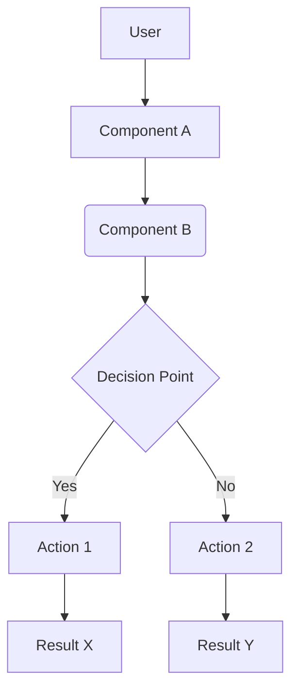

# System Patterns: [Your Project Name Here]

## 1. System Architecture Overview

*Provide a high-level description of the system's architecture. Include diagrams if they are helpful and can be represented in Markdown (e.g., Mermaid.js for flowcharts, ASCII diagrams).*

- (Placeholder: Brief description of the architecture - e.g., Monolith, Microservices, Client-Server, CLI tool, Web App with Frontend/Backend.)
- (Placeholder: Key components and their primary interactions.)

*(Replace with your actual architecture diagram/description)*

## 2. Key Technical Decisions & Rationales

*Document significant technical decisions made during the project's lifecycle and the reasons behind them.*

- **Decision 1:** (Placeholder: e.g., Choice of primary programming language - Python, Java, JavaScript)
  - **Rationale:** (Placeholder: e.g., Team expertise, library availability, performance needs.)
- **Decision 2:** (Placeholder: e.g., Choice of database - PostgreSQL, MongoDB, SQLite)
  - **Rationale:** (Placeholder: e.g., Data structure, scalability requirements, ACID compliance.)

## 3. Design Patterns in Use

*List any common software design patterns employed in the codebase (e.g., Singleton, Factory, Observer, MVC, Repository).*

- (Placeholder: Design Pattern 1 - e.g., MVC for UI structure)
- (Placeholder: Design Pattern 2 - e.g., Repository for data access)

## 4. Component Relationships & Data Flow

*Describe how major components interact and how data flows through the system. This may elaborate on the architecture overview.*

- (Placeholder: Detailed interaction between Component X and Component Y.)
- (Placeholder: Typical data flow for a primary use case, e.g., user registration, order processing.)

## 5. Error Handling & Logging Strategy

*How are errors handled throughout the system? What is the approach to logging?*

- **Error Handling:** (Placeholder: e.g., Use of try-except blocks, custom exceptions, global error handlers.)
- **Logging:** (Placeholder: e.g., Standard logging library for the language, log levels used, log aggregation system if any.)

---
*This document details the architectural and technical design of the project. It builds upon `projectbrief.md` and informs `activeContext.md` by providing context on how the system is built.*
